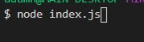
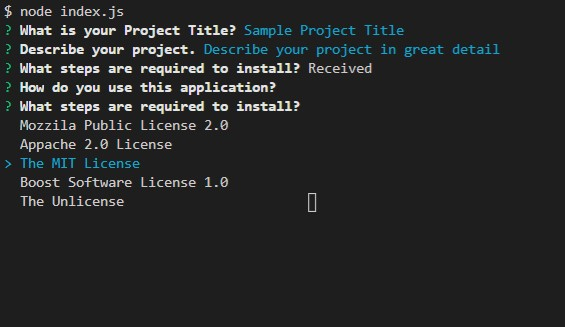
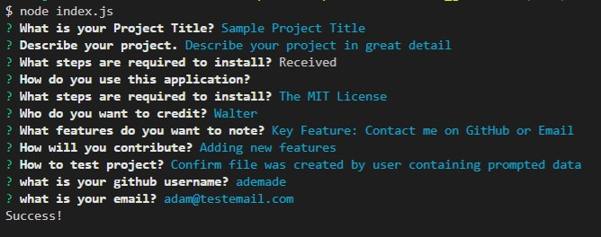

# ReadMe Generator 

## Description

Create Professional Readme files with a quick and simple automater. Use this readme generator to very simply and more importantly very quickly generate professional readme files to include in your next application. The Readme Generator includes everything you would require for your readme file. Project Title, Description, License information, even contact information. 

## How to use
To use this readme generator simply launch via the command line in the directory to which you stored the downloaded files. Type in node index.js and follow the prompts to fill out the respective content sections. Check out the walk through video link below for more information, or have a look at the screenshots. 

## Github Repo Link
https://github.com/adamnatrop/readme_generator

## Walkthrough Video Link

Click on the link to watch a walkthrough video on how to use the readmeGenerator

https://vimeo.com/532044827/18e9a40033

## Screenshots 

Launch readme generator 

Fill out the prompts

Once everything is filled out and your readme is generated you will see a success prompt

